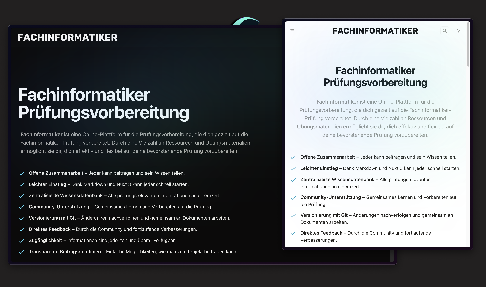

<p align="center">
  <a href="https://fachinformatiker.site" target="_blank" rel="noopener noreferrer">
    
  </a>
</p>

<h1 align="center"/>Fachinformatiker <sup><em>alpha</em></sup></h1>

<p align="center">
Online-Plattform zur Prüfungsvorbereitung mit zahlreichen Ressourcen und Übungsmaterialien für eine effektive und flexible Vorbereitung
</p>

<br/>
<p align="center">
  <a href="https://nyxb.chat"></a>
  <a href="https://pr.new/nyxb/Fachinformatiker"></a>
  <a href="https://volta.net/nyxb/Fachinformatiker?utm_source=Fachinformatiker_readme"></a>
</p>
<br/>

<p align="center">
  <a href="https://fachinformatiker.site/" target="_blank" rel="noopener noreferrer" >
    
  </a>
</p>

## ⚠️ Fachinformatiker ist derzeit in der Alpha-Phase.

Es ist bereits ziemlich nutzbar, aber noch nicht bereit für eine breite Anwendung. Wir empfehlen dir, es zu nutzen, wenn du uns beim Aufbau helfen möchtest. Wir schätzen dein Feedback und deine Beiträge. Sieh dir die [offenen Probleme](https://github.com/nyxb/Fachinformatiker/issues) an und steige in die Aktion ein. Tritt dem [Nyxb Discord Server](https://nyxb.chat) bei, um mit uns zu plaudern und mehr über das Projekt zu erfahren.

## Deployment

### Official Deployment

Das Nyxb-Team betreut eine Bereitstellung unter:

- 🦌 Produktion: [Fachinformatiker.site](https://fachinformatiker.site)
<br/>

## 💖 Sponsors

Wenn dir die App gefällt, erwäge, uns zu unterstützen:

- [Nyxb's GitHub Sponsors](https://github.com/sponsors/nyxb)

Wir würden es auch schätzen, wenn andere Beitragende zum Fachinformatiker-Projekt unterstützt würden. Wenn jemand dir hilft, ein Problem zu lösen oder eine gewünschte Funktion zu implementieren, wäre es hilfreich, diese Person zu unterstützen, um dieses Projekt nachhaltig zu gestalten.

## 📍 Roadmap

[Öffne das Board auf Volta](https://volta.net/nyxb/Fachinformatiker)

## 🧑‍💻 Contributing

Wir freuen uns sehr, dass du daran interessiert bist, zum Fachinformatiker beizutragen! Bitte lies die folgende Anleitung durch, bevor du deinen Beitrag einreichst.

### Online

Du kannst [StackBlitz Codeflow](https://stackblitz.com/codeflow) verwenden, um Bugs zu beheben oder Funktionen zu implementieren. Auf Pull Requests findest du auch eine Codeflow-Schaltfläche, um sie ohne lokale Einrichtung zu überprüfen. Sobald das Elk-Repository in Codeflow geklont wurde, startet der Entwicklungsserver automatisch und gibt die URL aus, um die App zu öffnen. Du solltest unten rechts eine Aufforderung erhalten, sie im Editor oder in einem anderen Tab zu öffnen. Um mehr zu erfahren, schau dir die [Codeflow-Dokumentation](https://developer.stackblitz.com/codeflow/what-is-codeflow) an. 

[](https://pr.new/nyxb/Fachinformatiker)

### Lokale Einrichtung

Klone das Repository und führe im Stammverzeichnis folgende Befehle aus:

```
pnpm i
pnpm run dev
```

`Warnung`: Du benötigst `corepack` aktiviert, schaue in der [Fachinformatiker Contributing Guide](./CONTRIBUTING.md) nach, um eine detaillierte Anleitung zur lokalen Einrichtung des Projekts zu erhalten.

Wir empfehlen die Installation von [nyxi](https://github.com/nyxb/nyxi/blob/main/docs/commands.md#nyxi), das den richtigen Paketmanager in jedem deiner Projekte verwendet. Wenn `nyxi` installiert ist, kannst du stattdessen folgende Befehle ausführen:

```
nyxi
nyxr dev
```

### Testing

#### ⚠️ Achtung: Die Testsuite ist derzeit nicht vollständig.

Fachinformatiker nutzt [Vitest](https://vitest.dev). Du kannst die Testsuite mit folgendem Befehl ausführen:

```
nyxr test
```

## 🦄 Stack

- [Vite](https://vitejs.dev/) - Next Generation Frontend Tooling
- [Nuxt](https://nuxt.com/) - The Intuitive Web Framework
- [Vue](https://vuejs.org/) - The Progressive JavaScript Framework
- [VueUse](https://vueuse.org/) - Collection of Vue Composition Utilities
- [Docus](https://docus.dev/) - The fastest way to create beautiful documentations

## 👨‍💻 Contributors

<a href="https://github.com/nyxb/Fachinformatiker/graphs/contributors">
     
</a>    

## 📄 License

[MIT](./LICENSE) &copy; 2023-PRESENT Fachinformatiker contributors
